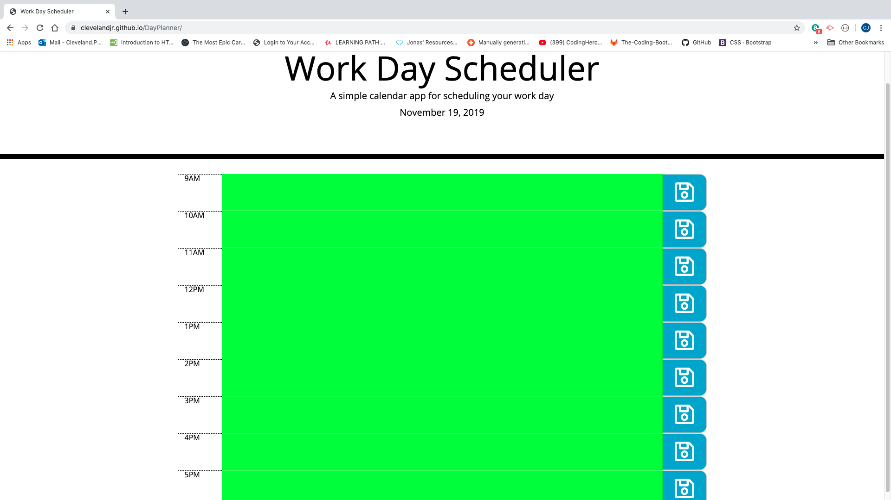
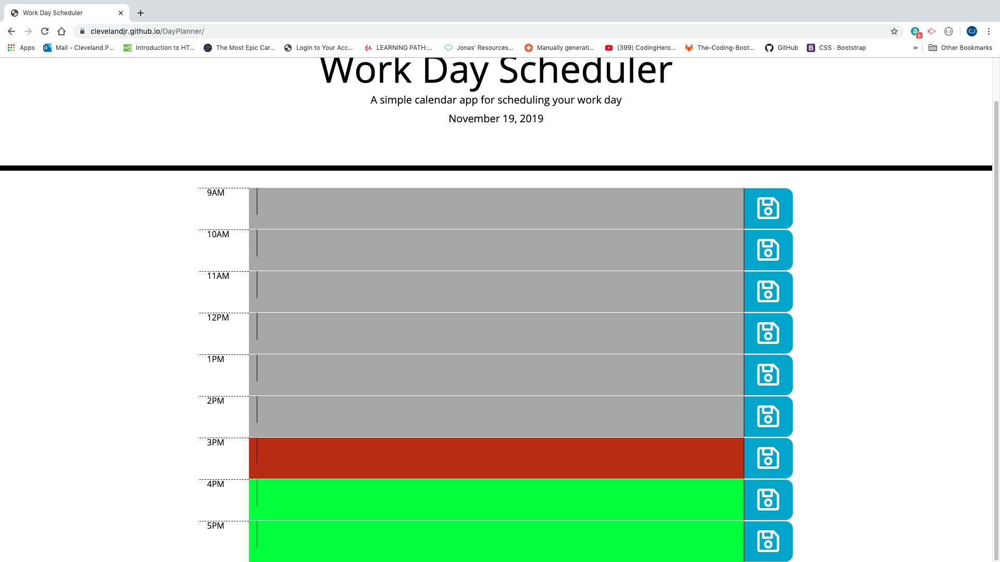

# DayPlanner
Day Planner
The Day Planner was my fifth assignment. 
My planner allows the user to save events for each hour of the work day. Once they click the save button, they can refresh the page and their note will save.
I started this planner by looking at previous class activities and using my google fu skills. My first part of my assignment was the time. I used the moments.js resource given to us and inserted that into my javascript page.
Here is the link to the working application https://clevelandjr.github.io/DayPlanner/

A few classmates and I pulled together resources from multiple pages to get our rows and columns. a good source for that was https://www.youtube.com/watch?v=TIMTit3II0I
I used w3 schools and overstack with a few other sites to start my storage. I also had help from my roomate who understands all of this.
To convert my strings into number I used https://www.geeksforgeeks.org/converting-strings-numbers-cc/ .

